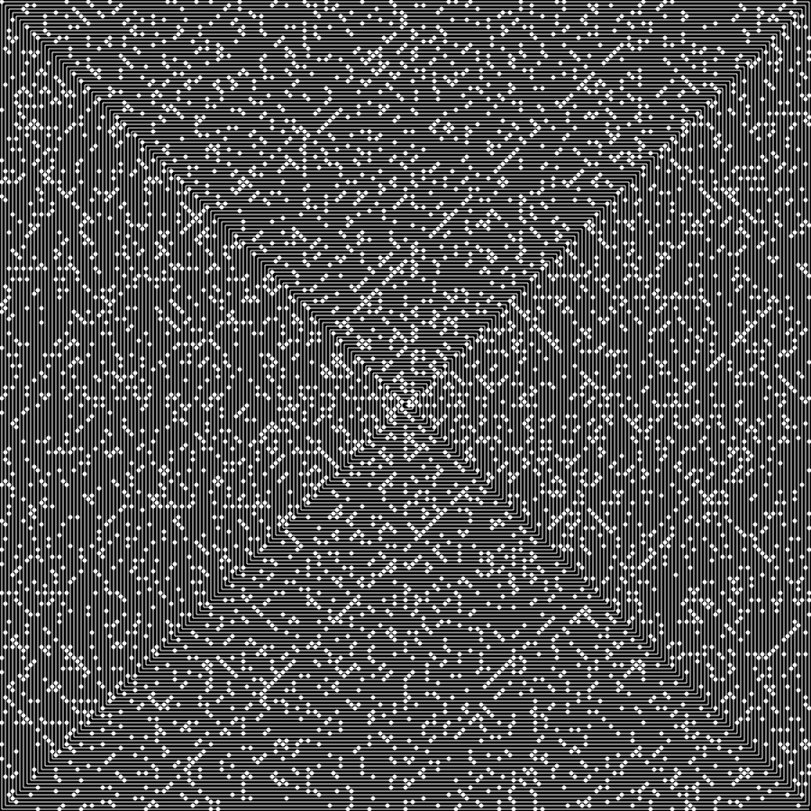

# Ulam's Spiral
#### using Vanilla JavaScript
---
## Canvas Screenshot

---
## What is Ulam's Spiral?

>The Ulam spiral or prime spiral is a graphical depiction of the set of prime numbers, devised by mathematician Stanisław Ulam in 1963 and popularized in Martin Gardner's Mathematical Games column in Scientific American a short time later.[1] It is constructed by writing the positive integers in a square spiral and specially marking the prime numbers. 

[Reference](https://en.wikipedia.org/wiki/Ulam_spiral)

---
## How to try
#### `clone` the repo and open the `index.html` file in your browser.

---
## To avoid repetition and increase reusability
### methods below are developed:

| **Methods** | **Descriptions** |
| ----------- | ----------- |
| function **drawCircle**(`canvasContext`: *CanvasRenderingContext2D*, `x`: *number*, `y`: *number*, `radius`: *number*, `fillColor`?: *string*, `strokeColor`?: *string*): void | Draws a circle at the `x` and `y` coordinates with the passed `radius`. `fillColor` and `strokeColor` is by default *#FFF* *white* |
| function **drawLine**(`canvasContext`: *CanvasRenderingContext2D*, `fromX`: *number*, `fromY`: *number*, `toX`: *number*, `toY`: *number*, `strokeColor`?: *string*): void | Draws a line from `fromX` and `fromY` coordinates to `toX` and `toY` coordinates. Passing `strokeColor` is optional and by default is *#FFF* *white* | 

